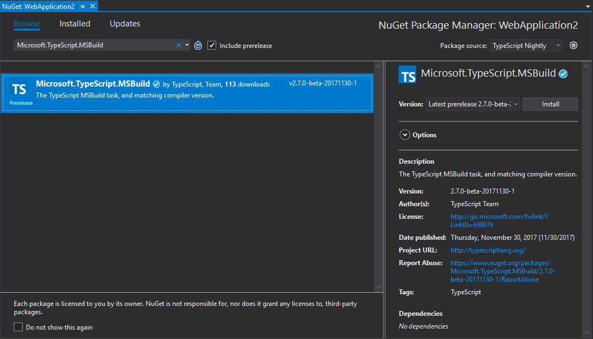

# Building via NuGet

As an alternative to using the TypeScript SDK with MSBuild to compile TypeScript, you can also use the TypeScript NuGet package `Microsoft.TypeScript.MSBuild`. This allows you to install a particular version of TypeScript locally to your project.

> :pushpin:
> One common use case for the NuGet package is for compiling TypeScript using the .NET Core CLI. Unless you are willing to hand-edit your project file to import build targets from a TypeScript SDK installation, the NuGet package is the only way to enable TypeScript compilation using .NET Core CLI commands such as `dotnet build` and `dotnet publish`.

>:warning:
> If you are using the NuGet package for MSBuild support for a given project, that project file must not itself import `Microsoft.TypeScript.Default.props` or `Microsoft.TypeScript.targets`.
> These will be imported by the NuGet package, so including them separately could cause unintended behavior. See [Removing Default Imports](#removing-default-imports) for details on what to remove.

## Installing major releases via NuGet (https://www.nuget.org)

* Right-Click -> Manage NuGet Packages
* Search for `Microsoft.TypeScript.MSBuild`

    

* Hit `Install`
* When install is complete, rebuild!

## Installing nightly drops (https://www.myget.org)

1. Add a new Package Source
 * Go to `Tools` -> `Options` -> `NuGet Package Manager` -> `Package Sources`
 * Create a new Source:
  * Name: `TypeScript Nightly`
  * Source: `https://www.myget.org/F/typescript-preview/`

       

2. Use the new Package Source
 * On Project node Right-Click -> `Manage NuGet Packages`
 * Search for `Microsoft.TypeScript.MSBuild`

      

 * Hit `Install`
 * When install is complete, rebuild!

## Removing default imports

* Right-Click -> `Unload Project`
* Right-Click -> `Edit <project file name>`
* Remove references to

 * `Microsoft.TypeScript.Default.props`

   The import should look something like:

     ```XML
    <Import
         Project="$(MSBuildExtensionsPath32)\Microsoft\VisualStudio\v$(VisualStudioVersion)\TypeScript\Microsoft.TypeScript.Default.props"
         Condition="Exists('$(MSBuildExtensionsPath32)\Microsoft\VisualStudio\v$(VisualStudioVersion)\TypeScript\Microsoft.TypeScript.Default.props')" />
     ```

 * `Microsoft.TypeScript.targets`

   The import should look something like:

     ```XML
    <Import
        Project="$(MSBuildExtensionsPath32)\Microsoft\VisualStudio\v$(VisualStudioVersion)\TypeScript\Microsoft.TypeScript.targets"
        Condition="Exists('$(MSBuildExtensionsPath32)\Microsoft\VisualStudio\v$(VisualStudioVersion)\TypeScript\Microsoft.TypeScript.targets')" />
     ```

## Package structure details

`Microsoft.TypeScript.MSBuild.nupkg` contains two main folders:

* `build` folder

    Two files are located in this folder.
    Both are entry points - for the main TypeScript target file and props file respectively.

    1. Microsoft.TypeScript.MSBuild.targets

        This file sets variables that specify the run-time platform, such as a path to `TypeScript.Tasks.dll`, before importing `Microsoft.TypeScript.targets` from the `tools` folder.

    2. Microsoft.TypeScript.MSBuild.props

        This file imports `Microsoft.TypeScript.Default.props` from the `tools` folder and sets properties indicating that the build has been initiated through NuGet.

* `tools` folder

    Versions prior to 2.3 only contain a tsc folder. `Microsoft.TypeScript.targets` and `TypeScript.Tasks.dll` are located at the root level.

    In versions 2.3 and later, the root level contains `Microsoft.TypeScript.targets` and `Microsoft.TypeScript.Default.props`. See [MSBuild Configuration](xref:msbuild) for more details on these files.

    Additionally, the folder contains three subfolders:

    1. `net45`

        This folder contains `TypeScript.Tasks.dll` and other DLLs on which it depends.
        When building a project on a Windows platform, MSBuild uses the DLLs from this folder.

    2. `netstandard1.3`

        This folder contains another version of `TypeScript.Tasks.dll`, which is used when building projects on a non-Windows machine.

    3. `tsc`

        This folder contains `tsc.js`, `tsserver.js` and all dependency files required to run them as node scripts.
        > :pushpin:
        > If Visual Studio is installed then the `node.exe` bundled with it will automatically be picked up. Otherwise Node.js must be installed on the machine.

        Versions prior to 3.1 contained a `tsc.exe` executable to run the compilation. In version 3.1 this was removed in favor of using `node.exe`.
