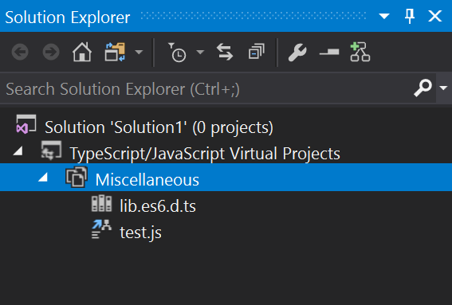

# Project configuration

TODO: Details configured, external, and inferred project/context types.

## External projects
The VS/MSBuild default

```xml
<TypeScriptToolsVersion>2.5</TypeScriptToolsVersion>
```

## Configured projects
Just add a `tsconfig.json` file, e.g.

```json
{
	"compilerOptions": {
		"target": "es5",
		"module": "commonjs"
	}
}
```

## Inferred projects
The leftovers will appear in the Virtual Projects node as:


