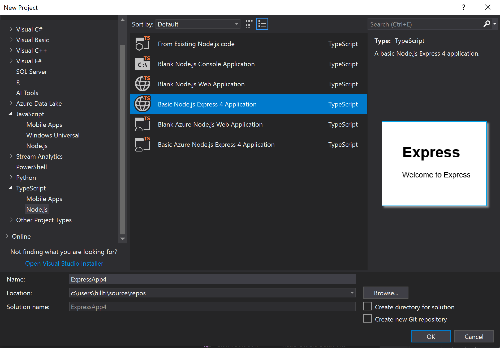
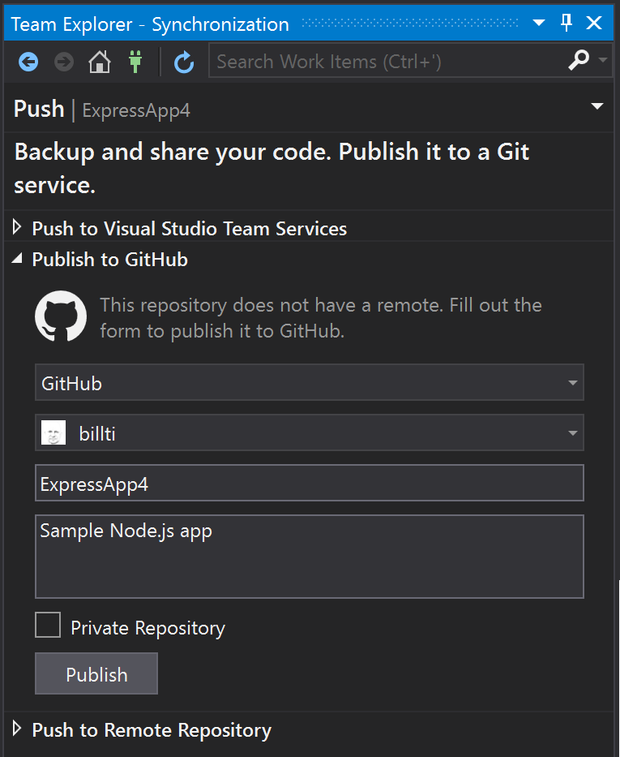
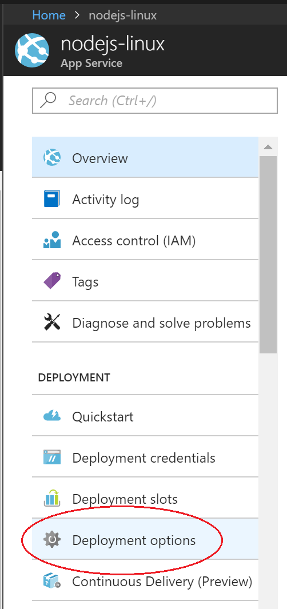
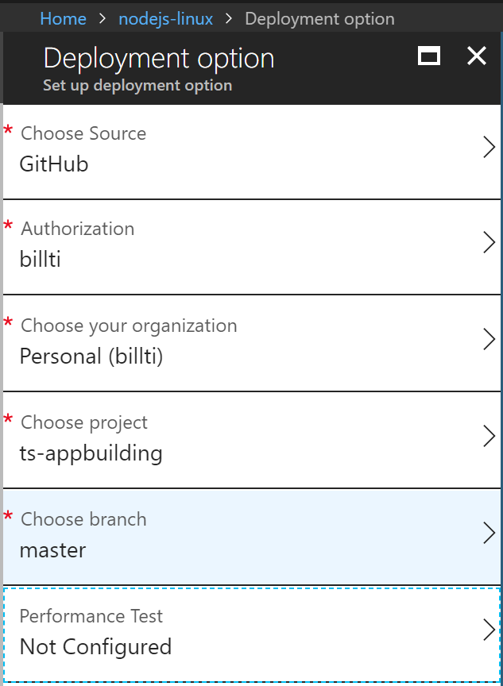
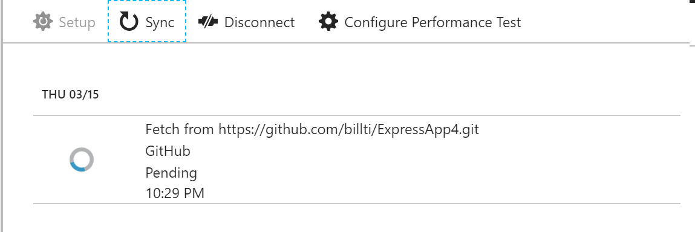

# Publishing to Azure

This tutorial will walk through creating a simple Node.js application and
publishing it to Azure.

There are a number of options when publishing a Node.js application to Azure. 
These include the Azure App Service, a VM running an OS of your choosing, the
Azure Container Service (AKS) for management with Kubernetes, a Container
Instance using Docker, and more. For more details on each of these options refer
to https://azure.microsoft.com/en-us/product-categories/compute/

For this tutorial, the app will be deployed to the [Linux App Service](https://docs.microsoft.com/en-us/azure/app-service/containers/app-service-linux-intro).
The Linux App Service deploys a Linux Docker container to run the Node.js application
in, as opposed to the Windows App Service, which runs Node.js apps behind IIS on
Windows.

The [Create Node.js App](https://docs.microsoft.com/en-us/azure/app-service/containers/quickstart-nodejs)
tutorial outlines how to use the command-line to provision the Azure App Service and
push the code from a local Git repository. This tutorial will outline how to
create a Node.js application starting from a template installed with the Node.js
Tools for Visual Studio, push the code to a repository on GitHub, and then provision
the Azure App Service via the Azure web portal to deploy from the GitHub repository.

To get this scenario up and running, three things are required:

1. The Node.js project to run in the Azure App Service
2. A GitHub repository to push the code to
3. The Azure App Service to host the project

The details for each of these steps follows.

## Create a Node.js project to run in Azure

 -  Create a new TypeScript Express app using the "File / New Project" dialog.

 - Press F5 to build and run the app, and ensure everything is running as expected.
 - Select "File / Add to source control" to create a local Git repository for the project.

At this point, a Node.js app using the Express framework and written in TypeScript
is working and checked in to local source control. Edit the project as desired before
processing to the next steps.

## Pushing code from Visual Studio to GitHub

For more details on the GitHub extension for Visual Studio, see https://visualstudio.github.com/

 - Ensure the GitHub for Visual Studio extension is installed and enabled via the 
menu item "Tools / Extensions and Updates".
 - From the menu select "View / Other Windows / GitHub", and the below should appear.
Click on "Get started".

 - If already connected to GitHub, the toolbox should appear similar
to the below. Fill out the fields for the new repository to publish, then click "Publish".

 - After a few moments, a banner stating "Repository created successfully" should appear.

The next steps will publish from this repository to an Azure App Service on Linux.

## Create a Linux App Service in Azure

 - Log in to the Azure portal at https://portal.azure.com
 - Select "App Services" from the list of services on the left, and then click "Add".
 - If required, create a new Resource Group and App Service plan to host the new app.
 - Be sure to set the OS to Linux, and the "Runtime stack" to the Node.js version
required (e.g. see image below).

 - Click the "Create" button to create the App Service. It may take a few minutes
to deploy.
 - Once created, open the App Service and select "Deployment Options".

 - Click on "Choose source", and then "GitHub". Configure any required permissions.

 - Select the repository and branch to publish, and select "OK".

 - The "Deployment options" page should appear as below while syncing. Once done
a check mark will appear.

The site should now be running the Node.js application from the GitHub repository,
and accessible at the URL created for the App Service (by default the name given
to the App Service followed by ".azurewebsites.net").

## Further steps

 - When the container starts up, it runs through various heuristics to figure out
how to start the Node.js process. Details of the implementation can be seen at 
https://github.com/Azure-App-Service/node/blob/master/8.9.4/startup/generateStartupCommand.js
 - The running container can be connected to via SSH for investigations.
This is easiest done via the Azure Portal. Select the App Service, and scroll down
the list of tools until reaching "SSH" under the "Development Tools" section.
 - A custom domain name may be assigned to the site, rather than the *.azurewebsites.net
URL assigned by default. For more details, see the topic [Map Custom Domain](https://docs.microsoft.com/en-us/azure/app-service/app-service-web-tutorial-custom-domain)
 - Deploying to a staging site for further testing before moving into production is
a best practice. For details on how to configure this, see the topic
[Create staging environments](https://docs.microsoft.com/en-us/azure/app-service/web-sites-staged-publishing).
 - See the [App Service on Linux FAQ](https://docs.microsoft.com/en-us/azure/app-service/containers/app-service-linux-faq)
for more commonly asked questions.
