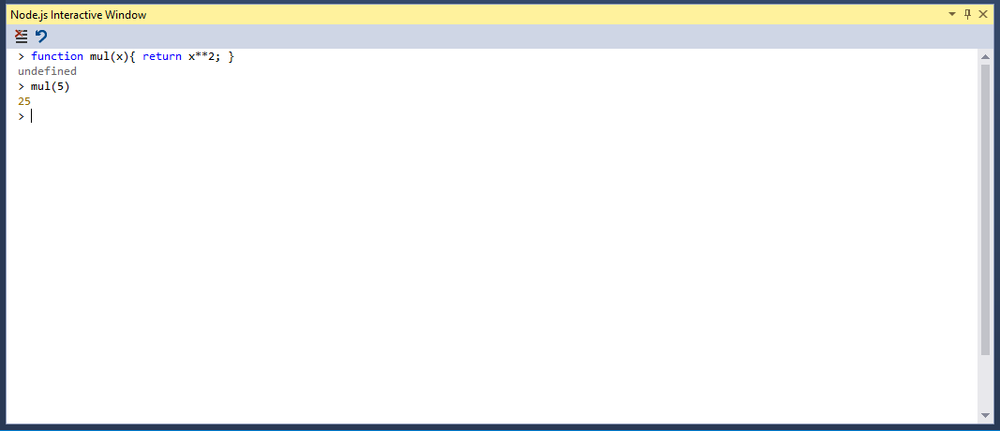

# The Node.js interactive window

Node.js Tools for Visual Studio includes an interactive window for the installed Node.js runtime. This allows you
to enter JavaScript and see the results immediatly, as well as execute npm commands to interact with the current 
project. The interactive window is also known as a REPL (**R**ead/**E**valuate/**P**rint **L**oop).

## Opening the interactive window

The default short-cut keys for the Node.js interactive window are [CTRL] + K, N.

You can also find it in the View - Other Windows menu.

And finally you can Right-Click on the Node.js project node, and select the interactive window.

## Commands

The interactive window has several built-in commands, which start with a dot prefix, to distinguish them from 
any JavaScript function you declare.

### .help
Show a list of REPL commands.

### .clear
Resets the context object to an empty object and clears any multi-line expression.

### .cls
Clears the contents of the REPL editor window.

### .echo
Suppress or unsuppress output to the buffer.

### .info
Show information about the current used Node.js executable.

### .npm
Executes npm command. If solution contains multiple projects, specify target project using 
`.npm [ProjectName] <npm arguments>`. 
You can find more information in the [npm section](npm.md#interactiv).

### .reset
Reset to an empty execution engine, but keep REPL history.

### .save
Clears the contents of the REPL editor window.

### .wait
Wait for at least the specified number of milliseconds.