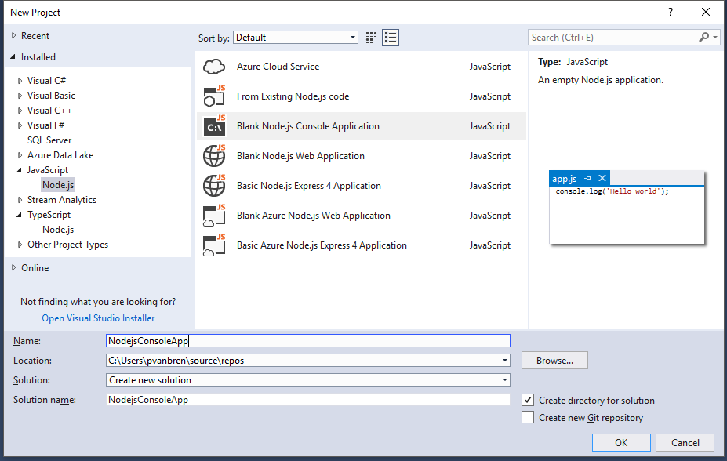

# Node.js

Node.js Tools for Visual Studio projects are based on the [solutions and projects model in Visual Studio](https://docs.microsoft.com/en-us/visualstudio/ide/solutions-and-projects-in-visual-studio). 
A project contains all the source code files, images, etc. and configuration files like package.json. 
Node.js project files have an `.njsproj` extension.

## Creating a Node.js Project

Visual Studio makes it easy to start a new Node.js project from scratch, or based existing code.
This is done through a number of pre-defined project templates, which are available both for 
TypeScript and JavaScript developers.

You can create a new project from the Start Page in Visual Studio, or by selecting File -> New Project 
in the menu. The project templates are listed under the Node.js node under the JavaScript and TypeScript language sections.

 

## Project templates 
### Blank Node.js Console Application
This is a basic application that is a good starting point for any non-web Node.js project. With the default 
settings, your project will run and be debugged with the Node.js interpreter. After creation, you can add new 
modules and packages, edit files with IntelliSense, and interactively debug code.

### Blank Node.js Web Application
This project will run and debug in the web browser. This is a good starting point for any web based Node.js 
application. After creation, you can add new modules and packages, edit files with IntelliSense, and 
interactively debug code.

### Basic Node.js Express 4 Application
This project is based on the standard Node.js Express 4 template. This project will run and debug in the web 
browser. After creation you can add new apps to the project, add new packages and modules, edit page templates, 
and interactively debug code.

## Create Project from Existing files
If you already have existing Node.js code, e.g. generated by ember-cli, you can easily import this into a 
Visual Studio project. To get started, open up the new Project Dialog, and select the 
'From Existing Node.js code' template. 

> [!Tip]
> Make sure the location you select from the new project in the New Project Dialog, is on the same drive as the 
source code you want to add to project.

After selecting the template a wizard will open, which guides you through the selection of the file, and setting 
some default opens, e.g. the start file. 