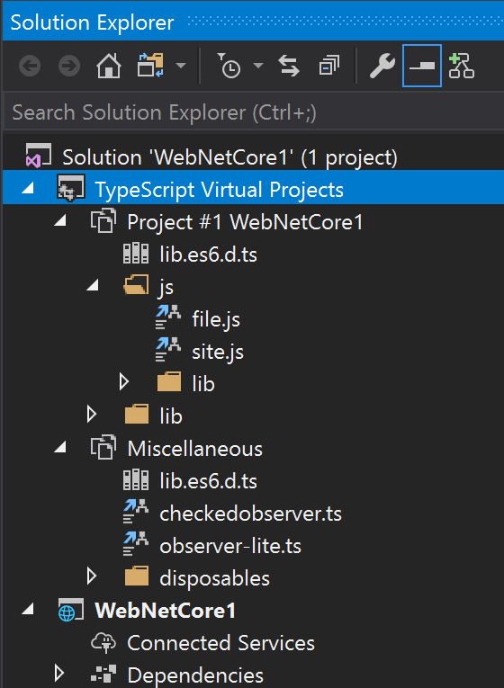

# Enable detailed language service logging

The "brains" of the language service largely runs in a node.exe process running the `tsserver.js` script.
Visual Studio communicates with this process to keep the project in sync, and ask questions for the
editor. This communication can be logged, which can be very helpful in identifying where issues might be
occurring.

Logging is easiest enabled by setting an environment variable. This can be set via system properties, or
on the command line before launching Visual Studio. Below describes how to do it via the command-line.

1. Open an instance of the `"Developer Command Prompt for VS 2017"` (or `2019`).
2. Create a folder for the logs, e.g. `C:\temp\logs`.  Note that this folder must exist _before_ logging begins.
3. Set the environment variable with a command such as: `SET TSS_LOG=-level verbose -file C:\temp\logs\tsserver.PID.log`
4. Launch Visual Studio from the same command prompt by running `devenv.exe`.
5. If your TypeScript version is less than 3.1, please `Disable dedicated syntax process` under Tools > Options > Text Editor > JavaScript/TypeScript > Language Service and restart Visual Studio (from the same command prompt).

After reproducing the problem, log files should be created in the folder specified. (There will be a `tsserver.<ProcId>.log` file
created for each langauge service process, and a `ti-<ProcId>.log` file created for any types installer processes).

> :warning:
> The log file may contain sensitive information, such as file paths, segments of code, and
> data used for completion lists, signature help, etc. Review the file before sharing if this is a concern.

Of particular interest in the log file, depending on the problem, may be the project structures that get
created and the files & settings they contain, and the execution time for each request to be processed.

# Gathering an ETW trace of detailed analysis

For in-depth analysis, it can be useful to gather an ETW log with detailed tracing. (For more information
on ETW, see [this MSDN documentation](https://msdn.microsoft.com/en-us/library/windows/desktop/bb968803).

One of the most powerful tools to capture (and view) ETW events is PerfView. PerfView is an open source
tool and the latest release can be downloaded from https://github.com/Microsoft/perfview/releases .

With PerfView downloaded and the executable extracted and unblocked, open a `"Developer Command Prompt for VS 2017"` (or `2019`)
with Administrative rights, and run the following commands:

1. `SET VSEXE=%VSINSTALLDIR%Common7\IDE\devenv.exe`
2. `SET ETWPROV=*TypeScriptEventSource,*Microsoft-VisualStudio-Common`
3. `PerfView -KernelEvents:FileIOInit,ThreadTime -Providers:%ETWPROV% -CircularMB:4096 -BufferSizeMB:256 run "%VSEXE%"`

Visual Studio should launch. Reproduce the issue, then stop the PerfView trace by closing Visual Studio
and allowing the trace to finish packaging. Do not hit Cancel in PerfView, as this will make the trace unusable.
The zip file created contains detailed logging of file access, asynchronous tasks, Visual Studio internal
events, and events from the TypeScript/JavaScript language service.

> :warning:
> The log file created can be extremely large - in the order of hundreds of megabytes per minute - and
> contains system-wide details including call-stacks, file access, etc. Ensure you have sufficient
> disk space, stop logging promptly after reproducing the problem, and do not share the trace if it may
> contain private data.

# Viewing the files in the project contexts

Often it is useful to understand the source files that are contributing to the contexts created
within the language service. By checking the "Display Virtual Projects when a Solution is loaded"
option in the "Tools" / "Options" dialog as shown above, Solution Explorer in Visual Studio will add a
"TypeScript Virtual Projects" node under the solution as shown below, which contains a child node
for each context created, that shows all the files contained within it.

Analyzing the contexts created may highlight an area where more source is being included than expected,
and this may then be corrected via configuration options as outlined above.

