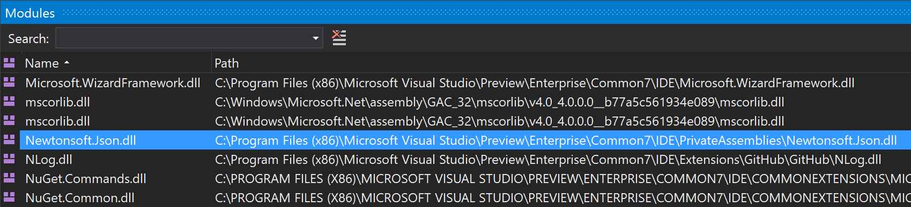

# NewtonSoft.Json versioning issues

Visual Studio communicates with the JavaScript and TypeScript language service using JSON. To
deserialize these messages, Visual Studio uses the very popular [Json.NET package from NewtonSoft](https://www.newtonsoft.com/json). If a different version of this assembly is loaded into memory
than expected, then subtle differences in behavior can cause deserialization to fail, and thus failure
to communicate with the language service.

The easiest way to check if the expected version of NewtonSoft.Json is being loaded, it to launch
another instance of Visual Studio and attach to the instance having issues, and load the "Modules"
window to check the assembly path. For example, once the problem occurs:

1. Run another instance of Visual Studio (e.g. from the Developer Command Prompt, run "devenv.exe").
2. From the menu of the new instance select "Debug" / "Attach to Process..."
3. Select the existing "devenv.exe" process from the list, and ensure the "Attach to" option reads "Automatic: Managed (v4.6, v4.5, v4.0) code"
4. Once attached, from the menu select "Debug" / "Windows" / "Modules"
5. Locate "NewtonSoft.Json.dll" in the list and note the "Path".

The path to the loaded module should be under the "Common7\IDE\PrivateAssemblies" folder of the Visual
Studio installation path, as shown below.



If the path is somewhere under the folder "C:\Windows\Microsoft.Net\assembly", then a version has been
installed to the GAC, and this is being loaded instead of the Visual Studio version. As all 9.x releases
of NewtonSoft.Json have an assembly version of "9.0.0.0", it is not possible to redirect assembly loading
and avoid using the GAC. There are two potential solutions to this.

### Remove NewtonSoft.Json from the GAC
Removing the copy of NewtonSoft.Json.dll from the GAC is one approach. However it runs the risks of
breaking whatever application installed it to the GAC, as it may expect to still find it there. The
command to uninstall NewtonSoft.Json from the GAC is shown below. Run from a Developer Command Prompt
with Admin rights.

```
gacutil /uf NewtonSoft.Json
```

### Install the Visual Studio version into the GAC
The version of NewtonSoft.Json.dll that ships with Visual Studio 2017 is the latest (at the time of writing)
release with the "9.0.0.0" assembly version, so other applications depending on the version in the GAC
should be compatible with it. Therefore you could also install the version that ships with Visual Studio 2017
into the GAC to fix the version mismatch. To do so, from a Developer Command Prompt with Admin permissions,
run the command:

```
gacutil /if "%VSINSTALLDIR%Common7\IDE\PrivateAssemblies\Newtonsoft.Json.dll"
```
