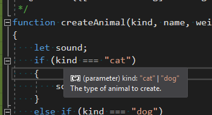
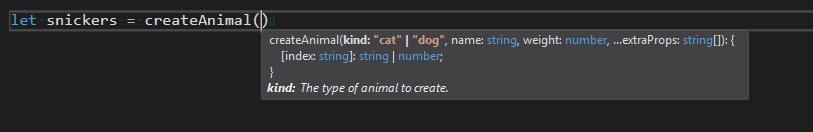

# JsDoc support

Programs written in JavaScript and TypeScript can be annotated with (JsDoc comments)[http://usejsdoc.org/index.html]
to give type information and quick-info descriptions of identifiers.

In the following example, the text between the opening `/**` and closing `/*` are considered JsDoc comments.

```js
/**
 * @param {"cat" | "dog"} kind  The type of animal to create.
 * @param name {string}
 * @param {number} weight The weight, in pounds, of animal.
 * @param {...string} extraProps Any extra properties to tack on the animal.
 * @return {{[index: string]: string | number}} Any extra properties to tack on the animal.
 */
function createAnimal(kind, name, weight, ...extraProps)
{
    // ...
}
```

As you can see, we can prefix sections in JsDoc with terms such as `@param` and `@return` to describe the behavior of the `createAnimal` function.
In JsDoc, terms beginning with `@` have special meanings, and are called *tags*. The text between curly braces are descriptions of *types*,
which can be used by the developer to check that they are using a variable correctly -- they can go either before or after the construct's *name*.
In the example above, knowing that `weight` is a number can inform the developer to avoid calling `weight.length`.
Moreover, if the result of `createAnimal` is assigned to a variable, the return type of createAnimal propogates to the assigned value.

Finally, the text after the parameter names are *descriptions*, which show up as part of *quickinfo* anytime you hover over a construct that is documented



and while filling in the paramters in a function call.



Different constructs in JavaScript can use different forms of documentation, as described below.

Visual Studio offers a rich editing experience inside JsDoc comments. The editor offers auto-completion on tags, names, and types as well as auto-indentation. You can use F12 and Shift+F12 for Go-to-definition and Find-All-References, respectively, as well hovering for quickinfo.

## Supported Tags

Any tag may be used for documentation, but Visual Studio treats some tags specially to improve the editor's ability to catch errors and help with refactoring.
The following tags are handled specially. Each tag is followed by a description and example.

* `@param` -- describes a parameter to a callable construct (eg: a function). Type annotations and descriptions are optional.

```ts
/**
 * Repeats a string a certain number of times.
 * Also: the future is bright and consists of native string repetition:
 * https://developer.mozilla.org/en-US/docs/Web/JavaScript/Reference/Global_Objects/String/repeat
 *
 * @param {string} string  String to repeat
 * @param {number} times   Number of times to repeat string. Integer.
 * @see http://jsperf.com/string-repeater/2
 */
function repeatString(string, times) {
  if (times === 1) {
    return string;
  }
  if (times < 0) { throw new Error(); }
  var repeated = '';
  while (times) {
    if (times & 1) {
      repeated += string;
    }
    if (times >>= 1) {
      string += string;
    }
  }
  return repeated;
}
```

* `@return` -- describes the return value of a callable construct (eg: a function). Type annotations and descriptions are optional.

```ts
/**
 * Determine if the string ends with the specified substring.
 *
 * @param {string} haystack String to search in
 * @param {string} needle   String to search for
 * @return {boolean}
 */
function endsWith(haystack, needle) {
  return haystack.slice(-needle.length) === needle;
}
```

* `@class` -- tells Visual Studio to treat the next construct as a constructor. (Only available in JavaScript files)

```ts
var Cell = /** @class */ (function () {
    function Cell() {
    }
    return Cell;
}());
```

* `@augments` and `@extends` -- in JsDoc for class-like declarations, specifies which class the upcoming construct extends. Note that `@augments` and `@extends` are synonyms.

```ts
// @Filename: declarations.d.ts
 declare class Thing<T> {
     mine: T;
 }

// @Filename: dummy.js
 /**
  * @augments {Thing<string>}
  */
 class MyStringThing extends Thing {
     constructor() {
         // x is a string!
         var x = this.mine;
     }
 }
```

* `@template` -- used to specify type parameters for the following construct (c.f. polymorphism in JavaScript)

```ts
/**
 * @param {T} a
 * @template T
 */
function f(a) {
    return () => a
}
let n = f(1)();
```

* `@type` -- declares the type of the next construct:

```ts
/** @type {{key: "value"}} */
var x = JSON.parse(JSON.stringify({key: "value"}));
```

* `@typedef` -- Typedef tags can be used to declare types referenced in other JsDoc comments.
If a type is specified inline (in the same style as `@param`), that describes the shape of the `@typedef`'d name.
Alternatively, A JsDoc beginning with a `@typedef` tag and name can be followed by `@property` and `@member` tags to describe the shape of the named type.

```ts
/**
 * @typedef {{foo: number}} Foo1
 */

/**
 * @typedef Foo2
 * @property {number} foo
 */

/** @type {Foo1} */
const x = { foo: 0 };
```
* `@property` and `@memeber` -- used to describe properties as part of a `@typedef` type declaration. See above for an example.

## Type Syntax

TODO.

## JsDoc Scaffolding Support

If you would like to add JsDoc comments to an existing javascript construct, typing `/**` in front of a construct in Visual Studio will trigger scaffolding generation, which will stub out
JsDoc for the next construct:

Scaffolding-gneration is supported for the following constructs:

* function declarations
* method declarations
* constructor declarations
* method signatures
* variable statements
* most property assignments -- module import and export statements are excluded

## Bugs

Known issues and feature suggestiong fo JSDoc-related issues are tracked [here](https://github.com/Microsoft/TypeScript/labels/Domain%3A%20JSDoc). If you run into an issue with JsDoc, please first search for and upvote an existing issue. If none exists, please file a new issue.